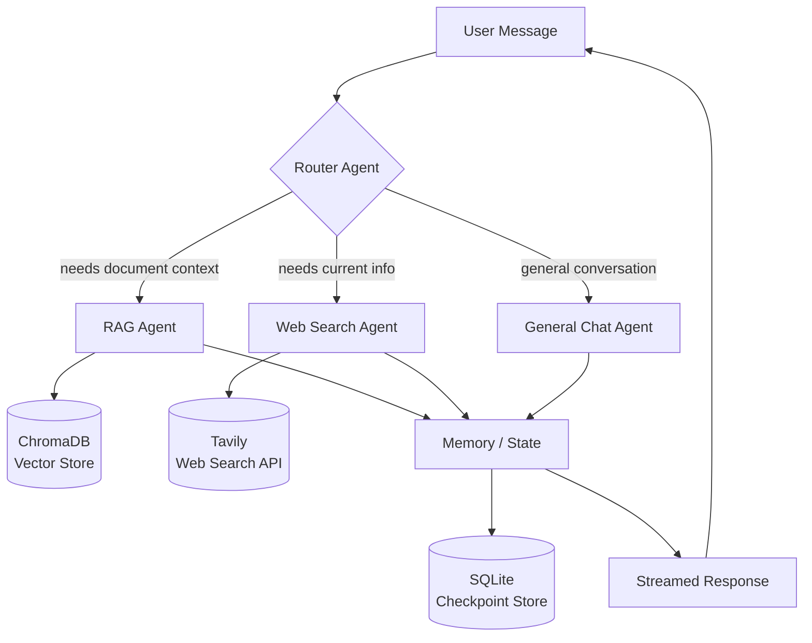

# ChatGPT-Clone

<p align="center">
  
  
  
  
  
  
  
  
  
  
  
  
  
</p>

<p align="center">
  
  
  
  
</p>

ChatGPT-Clone is an open-source agentic AI chatbot built with Python, FastAPI, LangGraph, LangChain, Google Gemini, Tavily, ChromaDB, and SQLite.

It supports real-time streaming chat, document uploads, retrieval-augmented generation (RAG), web search, conversation memory, a **multi-agent orchestration system**, and a simple web UI.

> Replace `YOUR_USERNAME` in the badge URLs above with your actual GitHub username once the repo is pushed.

## Table of Contents

- [Live Demo](#-live-demo)
- [What This Is](#what-this-is)
- [Features](#features)
- [Multi-Agent Architecture](#multi-agent-architecture)
- [Results & Performance](#results--performance)
- [Design Decisions](#design-decisions)
- [Prerequisites](#prerequisites)
- [Getting Started](#getting-started)
- [Environment Variables](#environment-variables)
- [Run Locally](#run-locally)
- [Project Structure](#project-structure)
- [Docker Deployment](#docker-deployment)
- [AWS CI/CD Deployment](#aws-cicd-deployment-with-github-actions)
- [Usage](#usage)
- [Contributing](#contributing)
- [License](#license)

## 🔗 Live Demo

Try the app here: **[https://chatgpt-clone-3-9d1u.onrender.com](https://chatgpt-clone-3-9d1u.onrender.com/)**

> Note: this is hosted on Render's free tier, so the app may take 30–60 seconds to wake up if it's been idle.

## What This Is

A production-style, self-hosted chat assistant that doesn't rely on a single monolithic LLM call. Instead, incoming messages are routed through a small graph of specialized agents (RAG, web search, general chat) built on LangGraph, so each type of query is handled by the component best suited for it — retrieved document context, live web results, or plain conversation — while conversation state persists across turns via SQLite.

## Features

- Chat with a multi-agent AI system powered by Google Gemini
- Multiple specialized agents (router, RAG agent, web-search agent, general chat agent) coordinated via LangGraph
- Stream responses in real time
- Upload documents such as PDF, DOCX, TXT, MD, PY, and CSV
- Use uploaded files as context through RAG
- Search the web with Tavily for current information
- Store and recall conversation history
- Simple FastAPI-based web interface
- Docker-ready deployment
- AWS CI/CD support using GitHub Actions, ECR, and EC2

## Project Overview

This project combines:

- **FastAPI** for the backend server and API endpoints
- **Jinja2** for rendering the frontend UI
- **LangGraph** for multi-agent orchestration — routing user queries to the right agent (RAG, web search, or general conversation) and managing shared state between agents
- **LangChain** for tools, messages, and RAG workflow
- **Google Gemini** as the LLM provider
- **Tavily** for web search
- **ChromaDB** for vector search over uploaded documents
- **SQLite** for conversation and persistence
- **Docker** for containerized deployment

## Multi-Agent Architecture

Instead of a single monolithic chat node, ChatGPT-Clone routes each user message through a graph of specialized agents:

- **Router Agent** — decides which agent(s) should handle the incoming query
- **RAG Agent** — answers questions using retrieved context from uploaded documents
- **Web Search Agent** — fetches current information via Tavily when the query needs up-to-date data
- **General Chat Agent** — handles conversational queries that don't require retrieval or search
- **Memory Layer** — persists conversation state across turns using SQLite-backed checkpointing

This lets each agent specialize in one task and keeps the overall system easier to extend (e.g. adding a code-execution agent or a summarization agent later).



> GitHub renders Mermaid diagrams natively in Markdown — this block shows as a live flowchart on the repo page, no image export needed.

## Results & Performance

> ⚠️ **Fill this in with real numbers before publishing.** Don't post placeholder or guessed metrics — reviewers (and interviewers) will ask how you measured them. Suggested things to actually measure and report:

| Metric | How to measure it |
|---|---|
| Router classification accuracy | Hand-label ~50–100 sample queries by intended agent, run them through the router, compute accuracy |
| Average response latency (streaming, first token) | Time from request sent to first streamed token, averaged over N runs |
| RAG retrieval relevance | Manually score top-k retrieved chunks on a sample of document Q&A queries |
| Uptime / usage | Pull from Render logs or your own request counter if you've deployed it |

Once you have real numbers, replace this table with a short results section (2–4 stats max, each with a one-line note on how it was measured).

## Design Decisions

Full reasoning also lives in [`DECISIONS.md`](./DECISIONS.md). Key choices below.

### 1. LangGraph multi-agent routing instead of one big prompt

**Choice:** Route each incoming message through a Router Agent that dispatches to a RAG agent, a web-search agent, or a general chat agent, instead of handling everything with a single system prompt and a big toolset.

**Why:** A single agent with many tools tends to guess wrong about which tool to reach for as the tool count grows, and it's hard to reason about or test in isolation. Splitting by responsibility means each agent only needs to be good at one thing (retrieval, search, or plain conversation), and the routing decision itself is testable independently of the agents it dispatches to.

**Trade-offs considered:**
- Adds an extra LLM call (the router) before the "real" answer starts, which costs latency on every request.
- More moving parts to maintain than a single chain — three agent files instead of one, plus the graph wiring.
- Worth it here because the project needs to demonstrate agent orchestration, and because it makes it straightforward to add a new agent (e.g. a code-execution agent) without touching the others.

### 2. ChromaDB for the vector store

**Choice:** ChromaDB, running locally/embedded, for document retrieval instead of a managed vector DB (Pinecone, Weaviate Cloud, etc.).

**Why:** No external account or network dependency to set up, it runs fine inside the same Docker container as the rest of the app, and it's a natural fit for a portfolio project where uploaded documents are per-session rather than at production scale.

**Trade-offs considered:**
- Won't scale the same way a managed service would under heavy concurrent load or very large document sets.
- No built-in multi-tenant isolation — fine for a single-user demo, would need rework for a real multi-user product.
- Chosen over a managed vector DB specifically to avoid extra paid infrastructure for a project that's meant to run on a free-tier host.

### 3. SQLite for conversation memory / checkpointing

**Choice:** SQLite-backed LangGraph checkpointing for conversation state, instead of Redis or a hosted Postgres instance.

**Why:** Zero additional infrastructure — it's a file on disk, which matches the single-container Docker deployment and keeps the free-tier Render hosting simple.

**Trade-offs considered:**
- Doesn't support concurrent writers well, so it wouldn't hold up under multiple simultaneous users hitting the same DB file hard.
- No built-in replication — if the container is destroyed without a persistent volume, history is lost.
- Acceptable here because the project's goal is to demonstrate the memory/checkpointing pattern, not to serve production traffic; swapping to Postgres later is a small change since LangGraph's checkpoint interface is storage-agnostic.

## Prerequisites

Make sure you have the following installed:

- Python 3.11
- pip or conda
- Git
- Google API key for Gemini
- Tavily API key for web search

Optional for deployment:

- Docker
- AWS account
- Amazon ECR repository
- EC2 instance
- GitHub Actions self-hosted runner

## Getting Started

### 1. Clone the repository

```
git clone https://github.com/<your-username>/ChatGPT-Clone.git
```

### 2. Navigate to the project directory

```
cd ChatGPT-Clone
```

### 3. Create a virtual environment

Using conda:

```
conda create -n chatgbtclone python=3.11 -y
```

### 4. Activate the virtual environment

```
conda activate chatgbtclone
```

### 5. Install dependencies

```
pip install -r requirements.txt
```

## Environment Variables

Create a `.env` file in the project root directory.

```
GOOGLE_API_KEY=your_google_api_key
GOOGLE_MODEL=gemini-2.5-flash

TAVILY_API_KEY=your_tavily_api_key

LANGSMITH_TRACING=false
LANGSMITH_ENDPOINT=https://api.smith.langchain.com
LANGSMITH_API_KEY=your_langsmith_api_key
LANGSMITH_PROJECT=chatgpt-clone
```

If you do not want to use LangSmith tracing, keep:

```
LANGSMITH_TRACING=false
```

## Run Locally

Start the FastAPI app:

```
python app.py
```

The app will be available at:

```
http://127.0.0.1:8080
```

## Project Structure

```
ChatGPT-Clone/
│
├── app.py                  # FastAPI app and streaming chat endpoints
├── agents/                 # Multi-agent definitions and LangGraph orchestration
│   ├── router_agent.py     # Routes queries to the correct specialized agent
│   ├── rag_agent.py        # Handles document-grounded (RAG) queries
│   ├── web_search_agent.py # Handles web search queries via Tavily
│   └── chat_agent.py       # Handles general conversational queries
├── database.py             # Conversation and persistence logic
├── rag.py                  # Document ingestion and RAG logic
├── tools.py                # Agent tools such as web search, memory, and RAG
├── requirements.txt        # Python dependencies
├── Dockerfile              # Docker image configuration
├── .dockerignore           # Docker ignore rules
│
├── templates/
│   └── index.html          # Frontend UI
│
├── uploads/                # Uploaded documents
├── data/                   # SQLite database and app data
└── chroma_db/              # ChromaDB vector database storage
```

## Docker Deployment

### 1. Build the Docker image

```
docker build -t chatgpt-clone .
```

### 2. Run the Docker container

```
docker run -d \
  --name chatgpt-clone \
  --restart always \
  -p 8080:8080 \
  --env-file .env \
  chatgpt-clone
```

The app will be available at:

```
http://localhost:8080
```

## AWS CI/CD Deployment with GitHub Actions

This project can be deployed to AWS using:

- GitHub Actions
- Amazon ECR
- Amazon EC2
- Docker
- GitHub self-hosted runner

### 1. Create an IAM User

Create an IAM user for deployment and attach the following policies:

- AmazonEC2ContainerRegistryFullAccess
- AmazonEC2FullAccess

You can also use a more restricted custom IAM policy for production.

### 2. Create an ECR Repository

Create an Amazon ECR repository.

Example full ECR image URI:

```
<your-account-id>.dkr.ecr.us-east-1.amazonaws.com/chatgpt-clone
```

For GitHub Secrets, only save the repository name:

```
ECR_REPO=chatgpt-clone
```

Do not save the full ECR URI as `ECR_REPO`.

### 3. Create an EC2 Instance

Create an Ubuntu EC2 instance.

Recommended inbound security group rule:

```
Type: Custom TCP
Port: 8080
Source: 0.0.0.0/0
```

### 4. Install Docker on EC2

Connect to your EC2 instance and run:

```
sudo apt-get update -y
sudo apt-get upgrade -y
```

Install Docker:

```
curl -fsSL https://get.docker.com -o get-docker.sh
sudo sh get-docker.sh
```

Add the Ubuntu user to the Docker group:

```
sudo usermod -aG docker ubuntu
newgrp docker
```

Check Docker:

```
docker --version
```

### 5. Configure EC2 as a GitHub Self-Hosted Runner

Go to your GitHub repository:

```
Settings → Actions → Runners → New self-hosted runner
```

Select Linux and follow the commands shown by GitHub.

After setup, start the runner:

```
./run.sh
```

For production, you can configure the runner as a service:

```
sudo ./svc.sh install
sudo ./svc.sh start
```

## GitHub Secrets

Add the following secrets in your GitHub repository:

```
AWS_ACCESS_KEY_ID
AWS_SECRET_ACCESS_KEY
AWS_DEFAULT_REGION
ECR_REPO

GOOGLE_API_KEY
GOOGLE_MODEL
TAVILY_API_KEY
LANGSMITH_TRACING
LANGSMITH_ENDPOINT
LANGSMITH_API_KEY
LANGSMITH_PROJECT
```

Path:

```
GitHub Repository → Settings → Secrets and variables → Actions → New repository secret
```

Example:

```
AWS_DEFAULT_REGION=us-east-1
ECR_REPO=chatgpt-clone
GOOGLE_MODEL=gemini-2.5-flash
LANGSMITH_TRACING=true
LANGSMITH_ENDPOINT=https://api.smith.langchain.com
LANGSMITH_PROJECT=chatgpt-clone
```

## GitHub Actions Workflow

Create this file:

```
.github/workflows/cicd.yaml
```

This workflow will:

- Build your Docker image
- Push the image to Amazon ECR
- Pull the latest image on EC2
- Stop the old container
- Run the new container

## Usage

After running locally or deploying to AWS:

- Open the app in your browser.
- Start chatting with the multi-agent AI assistant.
- Upload documents to use them as context.
- Ask questions about uploaded files.
- Ask current-information questions to trigger web search.
- Continue conversations with saved chat history.

## Example Questions

- Summarize the uploaded PDF.
- Search the web for the latest AI agent news.
- Based on my uploaded document, what are the key points?
- Calculate 125 * 48 / 6.

## Notes

- Do not commit your `.env` file to GitHub.
- Keep API keys inside GitHub Secrets for deployment.
- For production, avoid using `reload=True` in Uvicorn.
- Make sure port 8080 is open in your EC2 security group.
- Rotate any API keys that were accidentally exposed publicly.

## Resume Highlights

Use these bullet points on your resume or portfolio to describe this project:

- Designed and developed **ChatGPT-Clone**, a production-style multi-agent conversational AI system orchestrated with **LangGraph**, routing user queries across specialized agents (RAG, web search, general chat) for context-aware responses.
- Implemented **retrieval-augmented generation (RAG)** using **ChromaDB** for document-grounded Q&A over PDF/DOCX/CSV uploads, and integrated **Tavily** for real-time web search capabilities.
- Engineered a **FastAPI** backend with streaming chat endpoints, **SQLite**-backed conversation memory, and containerized the app with **Docker**, deploying to **AWS EC2** via an automated **GitHub Actions CI/CD pipeline** (ECR + self-hosted runner).

> Tip: if this project is going on your resume, consider using a more original name than "ChatGPT-Clone" — something like "GraphMind AI" reads as an independent product rather than a reference to an existing brand.

## Contributing

Contributions are welcome.

To contribute:

1. Fork the repository.
2. Create a new branch.
3. Make your changes.
4. Submit a pull request.

## License

This project is open source. Please check the repository license for usage terms.
